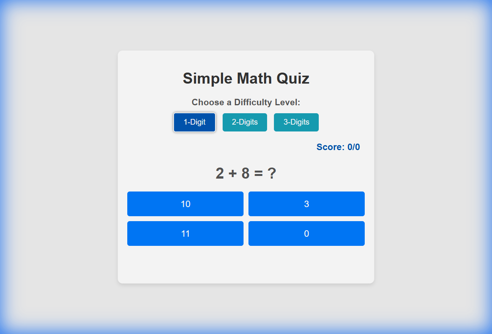
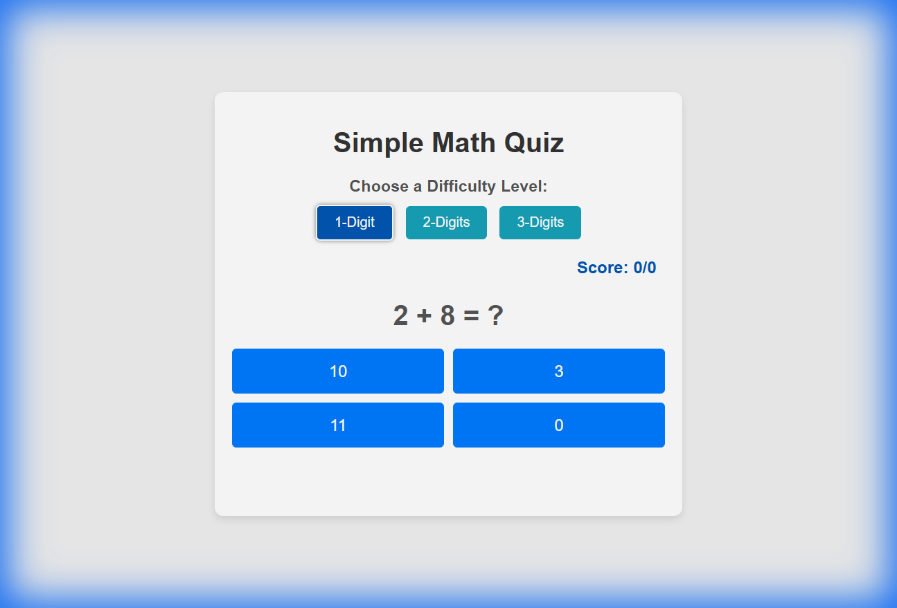
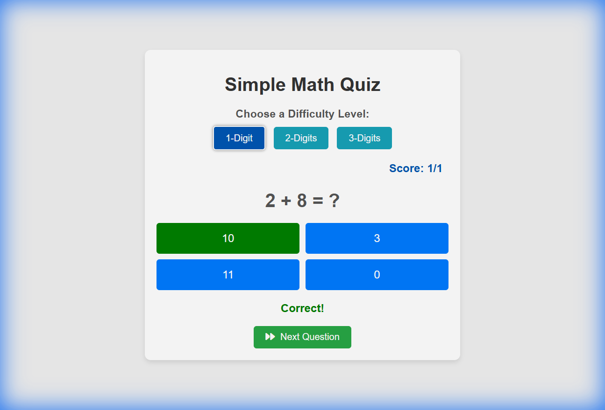
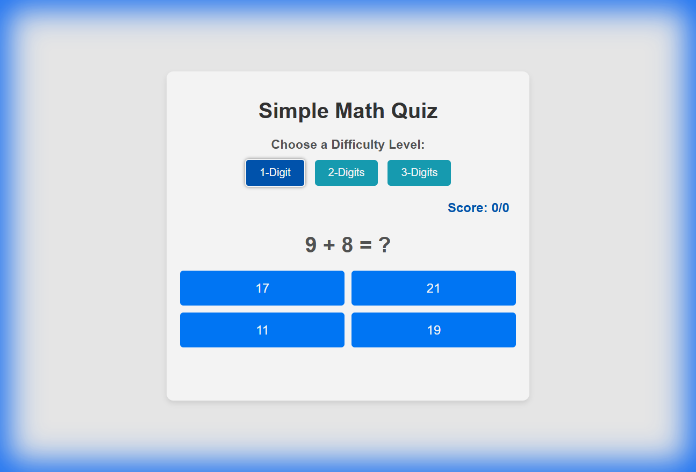
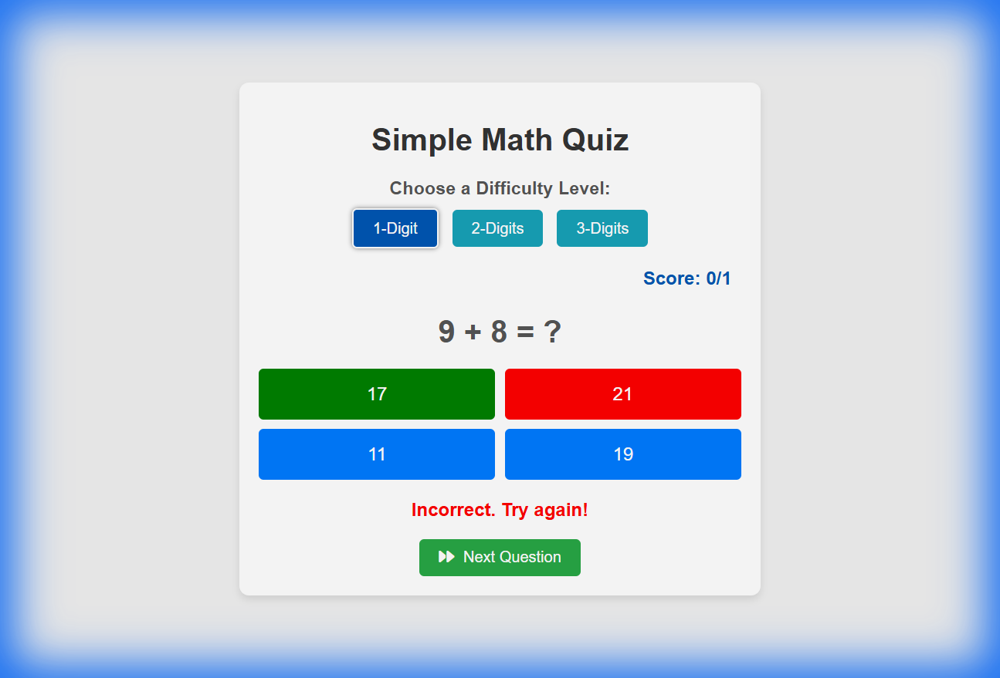

Area |	Test Case	| Expected result
Start Page	| Open web page	| Web page open without issues and warning
Start Page	| initial page should be 1-digit	| 1-digit is selected
Start Page	| initial page marks should be 0/0	| Score: 0/0
Start Page	| Right Answer	| Right answer becomes green and score increase by 1. A message "Correct!" appears
Start Page	| Wrong Answer	| Right answer becomes green, selected answer turns red and score total increases but correct answer does not. A message "Incorrect. Try again!" appears

# Documentation Generation Plan

## Goal Description
Generate a comprehensive UX documentation for the Simple Math Quiz application. The documentation will explain the user experience flow and include screenshots for each step, based on the `Test_cases.md` file. This documentation will serve as a basis for future e2e test generation.

## User Review Required
- [ ] Confirm the proposed structure of the UX Documentation.

## Proposed Changes
I will create a new artifact `UX_Documentation.md` in the artifacts directory. I will NOT be modifying the application code.

### [Documentation Structure]
The `UX_Documentation.md` will contain:
1.  **Overview**: Brief description of the app.
2.  **Test Scenarios**:
    -   **Scenario 1: Initial Load**: Screenshot of the start page, verifying 1-digit selection and 0/0 score.
    -   **Scenario 2: Correct Answer Flow**: Steps to select a correct answer, screenshot of the success state ("Correct!" message, green highlight), and score update verification.
    -   **Scenario 3: Incorrect Answer Flow**: Steps to select an incorrect answer, screenshot of the error state ("Incorrect" message, red/green highlights), and score update verification.

## Verification Plan
### Automated Verification
- None (I am generating documentation).

### Manual Verification
- I will manually verify that the generated `UX_Documentation.md` contains clear instructions and visible, relevant screenshots for all 5 test cases listed in `Test_cases.md`.
- I will verify the application behavior matches the descriptions in `Test_cases.md` during my exploration.

# Simple Math Quiz - UX Documentation

## Overview
This document outlines the user experience and expected behaviors for the Simple Math Quiz application. It serves as a guide for understanding the application flow and verifying its functionality against the defined test cases.

## Test Scenarios

### 1. Initial Load
**Goal**: Verify the default state of the application upon opening.

**Expected Behavior**:
- The "1-Digit" difficulty level is selected by default.
- The Score is initialized to "0/0".
- A random math problem is displayed.

---

### 2. Correct Answer Flow
**Goal**: Verify the user feedback and score update when a correct answer is selected.

**Step 1**: Identify the correct answer for the displayed problem (e.g., 2 + 8 = 10).

**Step 2**: Click the correct answer button.

**Expected Behavior**:
- The selected button is highlighted (typically green).
- A "Correct!" message is displayed below the options.
- The Score updates correctly (e.g., increments to 1/1).

---

### 3. Incorrect Answer Flow
**Goal**: Verify the user feedback and score update when an incorrect answer is selected.

**Step 1**: Identify the math problem (after a reset/refresh).

**Step 2**: Click an incorrect answer button (e.g., choosing 21 for 9 + 8).

**Expected Behavior**:
- The selected incorrect button is highlighted (typically red).
- The correct answer is also highlighted (green) to guide the user.
- A "Incorrect. Try again!" message is displayed.
- The Score updates to reflect the attempt (e.g., 0/1).

